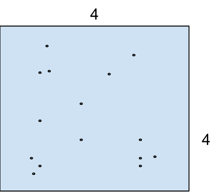
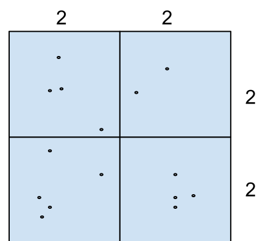
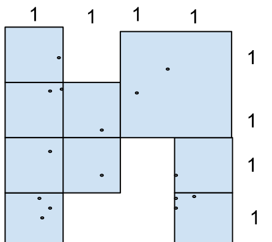

The JS
===

Here we are going to be getting into the JavaScript which will make [this map](http://calvinmetcalf.github.com/leaflet.demos), this is all the code that was in the 'script.js' file in the [previous post](1-html.md).

First thing we do is wrap it all up in a closure:

```js
(function () {
//code goes here
}());
```

Polluting the global namespace is a party foul and you shouldn't do it, I tend not to count the closure when doing my indents if for no other reason then I usually only put the closure in at the end after I've debugged it so I don't feel like adding an extra tab to each line, with that out of the way we do:

```js
var m = L.map('mapID').setView([42.36, -71.06], 15);
```

What this does is creates a new map, in an element called 'mapID' set at zoom level 15 and centered on Boston.  You may see this written in a couple different ways, for almost all Objects in leaflet there are two ways of creating them, a traditional Uppercase Object Creation method:

```js
var m = new L.Map('mapID');
```

and a lowercase factory function method:

```js
var m = L.map('mapID');
```

I always use the second method.  All objects almost always take a options object as the last argument, so I could have written that as:

```js
var m = L.map('mapID', {
	center: new L.LatLng(42.36, -71.06),
    zoom: 15
});
```

but most everything in leaflet supports the style jQuery made famous called "Method Chaining", which as an aside it turns out is just [a less pretentious term for 'monad'](http://blog.jorgenschaefer.de/2013/01/monads-for-normal-programmers.html), but I degrees instead of passing an option argument we can set the zoom and center with methods:

```js
var m = L.map('mapID').setZoom(15).panTo(new L.LatLng(42.36, -71.06));
```

It doesn't really make sense to set our zoom an pan separably as we don't have those yet, so good thing leaflet has another method called setView which does this in one go:

```js
var m = L.map('mapID').setView(new L.LatLng(42.36, -71.06), 15);
```

But wait we have lower case factory functions so we can write:

```js
var m = L.map('mapID').setView(L.latLng(42.36, -71.06), 15);
```

But wait longer because any place in leaflet that accepts a latLng is smart enough to also let you pass an array and turn into a latLng for you so:

```js
var m = L.map('mapID').setView([42.36, -71.06], 15);
```

And there we have it, going forward I will not be be going into quite as much detail about the different ways you can do things so keep these in mind.  

Next we set the layers, leaflet doesn't come with a default layer built in like Google Maps or Bing, so we need to set that, for serious projects I usually use [Map Quest Open](http://open.mapquest.com/) but I think doing something slightly more awesome is the order of the day here, so were going to set the default here to be the unbelievable [Stamen Watercolor map](http://maps.stamen.com/watercolor/) with a few more sensible ones available as well:

```js
var baseMaps = [
	"Stamen.Watercolor",
	"OpenStreetMap.Mapnik",
	"OpenStreetMap.DE",
	"Esri.WorldImagery",
	"MapQuestOpen.OSM"
];
var lc = L.control.layers.provided(baseMaps,{},{collapsed:false}).addTo(m);
m.addHash({lc:lc});
```

Whats going on here:
* We made an array of basemap names to pass to the
* layerControl that we're about to make, the other options are an empty Object, because we don't have any overlays yet and we want to pass an options object as argument 3 because we don't want it collapsed by default, then we add it to the map, we call it lc because the usually the only time we reference it is.
* When we add it as an option to the Hash we just added to the map, adding a layer control is the way to get it to show the names layers in the url.

At this point you have a working map, now some stuff for the custom maps we're making:

```js
var data={}, layers={}, fills = [
	"rgb(197,27,125)",
	"rgb(222,119,174)",
	"rgb(213, 62, 79)",
	"rgb(84, 39, 136)",
	"rgb(247,64,247)",
	"rgb(244, 109, 67)",
	"rgb(184,225,134)",
	"rgb(127,188,65)",
	"rgb(69, 117, 180)"
];
```

Data and layers we're going to make public latter hence why we're defining them here, fills is the color scheme we're going to use for our layers. 

The next thing we need to do is load the json file with our data, which in this case is a geojson file containing the location of 2,000 billboards in MA. Usually I'd just use jQuery or my [AJAX plugin for leaflet](https://github.com/calvinmetcalf/leaflet-ajax) (wow I feel like I'm constantly tooting my own horn in this post), but D3 comes with its own AJAX function for  getting data so instead we do:

```js
d3.json("json/oa.json", dealwithData);
```

so that was easy, but what about deal with data? It's a function that takes an an argument the json that was just parsed, in this case the function looks like:

```js
function dealwithData(oa){
	data.json= oa.features.map(function(v){
        return [v.geometry.coordinates[1],v.geometry.coordinates[0]];
	});
    points();
    veronoi();
    delaunay();
    clusters();
    quadtree();
}
``` 

Whats happening here is remember that empty data object I made earlier? we're giving it a json property which is an array made of of arrays with the coordinates switched from [x,y] format used by GeoJSON to the [lat,lng] format that leaflet uses.  Then we call a function for each layer we're going to add. 

```js
function points(){
    layers.points = L.layerGroup(data.json.map(function(v){
    	return L.circleMarker(L.latLng(v),{radius:5,stroke:false,fillOpacity:1,clickable:false,color:fills[Math.floor((Math.random()*9))]})
	}));
	lc.addOverlay(layers.points,"points");
}
``` 

the points, we are going to break this down a bit first

```js
    layers.points = L.layerGroup(data.json.map(function(v){
    	return L.circleMarker(L.latLng(v),{radius:5,stroke:false,fillOpacity:1,clickable:false,color:fills[Math.floor((Math.random()*9))]})
	}));
```

this complex mess can be broken down a slightly more readable:

```js
function makeColor(){
    var randomNumber = Math.floor((Math.random()*9));
    return fills[randomNumber];
}
function makePoint(v){
    var opts = {
        radius: 5,
        stroke: false,
        fillOpacity: 1,
        clickable: false,
        color: makeColor()
    }
    return  L.circleMarker(L.latLng(v),opts);
} 
var points = data.json.map(makePoint);
layers.point=L.layerGroup(points);
```

I'm only doing it this way so that all the layers are made in an equivalent manner, regularly I'd have just added the GeoJSON layer to the map without iterating through the data twice, something like

```js
function makeColor(){
    var randomNumber = Math.floor((Math.random()*9));
    return fills[randomNumber];
}
function makePoint(f,ll){
    var opts = {
        radius: 5,
        stroke: false,
        fillOpacity: 1,
        clickable: false,
        color: makeColor()
    }
    return  L.circleMarker(L.latLng(ll),opts);
} 
layers.points = L.geoJson(oa,{pointToLayer:makePoint});
```

But I degrees, I should note that it is a good idea to use circleMarkers instead of regular markers when you have lots of points, not only are the regular markers big and tend to crown a map, browsers often have a problem with displaying the icon 2000+ times. 

Anyway, how ever we do that we then added it as an overlay

```js
lc.addOverlay(layers.points,"points");
```

This adds the overlay we made at layers.points to the layer control with the creative title of "points", now were going to start doing the fancy d3 stuff and calculate the veronoi polygons, veronoi polygons are a shape where everything inside the the shape all are closest to the same thing, less confusingly image if you were making a map of closest Starbucks you could make veronoi polygons which would depict the area closest to each Starbucks :

```js
    data.veronoi = d3.geom.voronoi(data.json);
    layers.veronoi = L.layerGroup(data.veronoi.map(function(v){
		return L.polygon(v,{stroke:false,fillOpacity:0.7,color:fills[Math.floor((Math.random()*9))]})
	}));
	lc.addOverlay(layers.veronoi,"veronoi");
```

So you'll see that d3 when given an array of points you get back an array that instead of being made up of [lat,lng] is made up of [[lat1,lng1],[lat2,lng2]...], which oh hey is the exact same format that a leaflet polygon uses, everything else is exactly like the point example,

Next we have the delaunay triangles this is what happens when you connect all of the points to make a series of triangles,  

```js
    data.delaunay = d3.geom.delaunay(data.json);
    layers.delaunay = L.layerGroup(data.delaunay.map(function(v){
		return L.polygon(v,{stroke:false,fillOpacity:0.7,color:fills[Math.floor((Math.random()*9))]})
	}));
	lc.addOverlay(layers.delaunay,"delaunay");
```
you'll notice that the text is of this is exactly the same as the veronoi one, as it I did find replace on veronoi to delaunay, I could have made this more compact I'll point out, but I find this to be a bit too clever:

```js
lc.addOverlay(L.layerGroup(d3.geom.delaunay(data.json).map(function(v){
		return L.polygon(v,{stroke:false,fillOpacity:0.7,color:fills[Math.floor((Math.random()*9))]})
	})), "delaunay");
```
next I added marker clusters, so this isn't d3 but it seemed to fit

```js
    layers.clusters = new L.MarkerClusterGroup();
    layers.clusters.addLayers(data.json.map(function(v){
		return L.marker(L.latLng(v));
	}));
    lc.addOverlay(layers.clusters,"clusters");
```

This is pretty straight forward we just create a MarkerClusterGroup and add an array of of markers.  Since this is a plugin and not part of core we can't be sure there is a factory function for the MarkerClusterGroup hence why we use the uppercase version. 

Lastly we make a quadtree and then illustrate it on the map.

```js
  data.quadtree = d3.geom.quadtree(data.json.map(function(v){return {x:v[0],y:v[1]};}));
	layers.quadtree = L.layerGroup();
	data.quadtree.visit(function(quad, lat1, lng1, lat2, lng2){
		layers.quadtree.addLayer(L.rectangle([[lat1,lng1],[lat2,lng2]],{fillOpacity:0,weight:1,color:"#000",clickable:false}));
	});
	lc.addOverlay(layers.quadtree,"quadtree");
```

But wait, whats a quad tree, so a quad tree is a form of spatial index where each node has 4 children. to put it in other terms. 

You divide you map into quarters then check how many points are in each quarter, if a quarter has more points than some minimum you set (lets say 3) then you repeat on that quarter etc. You can now do bounding box and other types of queries much more easily because you've stored the data in terms of location.  

So the details of the d3 implementation. It takes an array made up of {x:num,y:num} Objects, and returns a quad tree object, we do that here:

```js
data.quadtree = d3.geom.quadtree(data.json.map(function(v){
    return {x:v[0],y:v[1]};
}));
```

The quadtree object then has method 'visit' which takes a function, that function is called once for each node with the arguments node, lat1, lng1, lat2, lng2, if it returns true it doesn't visit that nodes children, if it returns false (returning nothing is false).

Back to our original example, if we had a 4x4 map, 



the function would be called with (node, 0,0,4,4) then the first iteration would return 



and it would be called with 
(node, 0,0,2,2)
(node, 0,2,2,4)
(node, 2,0,4,2)
(node, 2,2,4,4)



then notice that the upper right quadrant hasn't been called again this is because it is at the minimum, the function would then only be called again on boxes that have things in it. 

Usually this function is used to limit your search if you know your search is near 3,3 you can skip all the boxes that don't include that point which cuts down your search tremendously, instead here where using each of those function calls to create a rectangle and adding it to the map, voila. 

The very last thing we do is something special:

```js
window.public = {};
window.public.data = data;
window.public.layers = layers;
```

we create an object called public and and attach it to the window, we then put the layers and data in it. I don't normally do this, but today I made an exception so you can open the developer tools (chrome ctr+shift+i, IE f12, firefox ctrl+shift+k) and look at this stuff.  Now [go play with the map we made.](http://calvinmetcalf.github.com/leaflet.demos)
